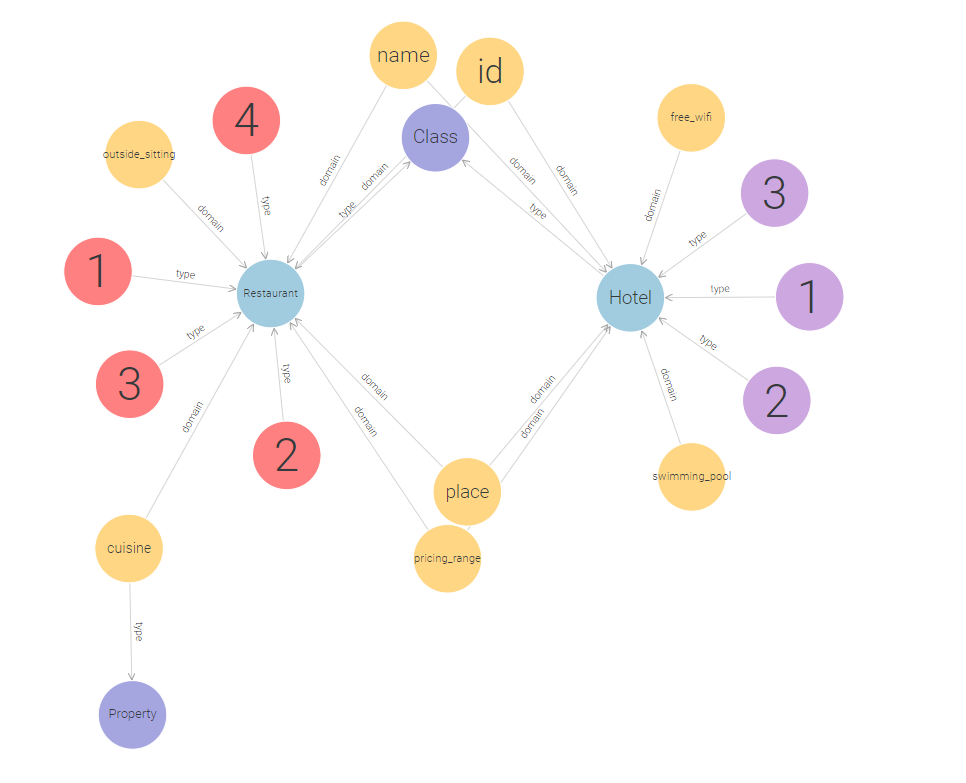
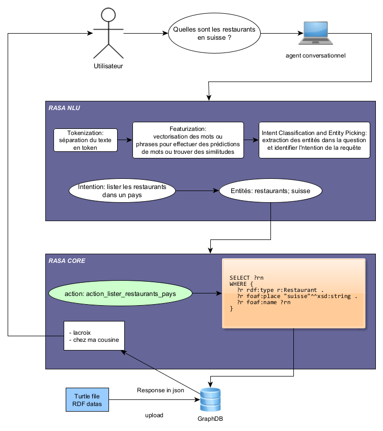

# Rasa knowledge base (POC, travail bachelor)

Construction d'un chat bot connecté à un graphe de connaissances (données rdf).

Le graphe de connaissances se situe dans le répertoire **data,** fichier `knowledge_base.ttl` Les données rdf ont été stocké dans un triple store (GraphDB).

## But du chatbot

Le but du chatbot est de renseigner les utilisateurs sur les restaurants (et éventuellement les hotels). Les types de questions auxquelles le chatbot peut répondre sont les suivantes :

* lister tous les restaurants
* lister les restaurants qui se trouvent dans un pays
* lister les restaurants qui ont une certaine tranche de prix dans un pays (*cette question se réfère à la question précédente en utilisant le nom du pays mentionné dans la conversation précédente*)

## Fonctionnement du chat bot

